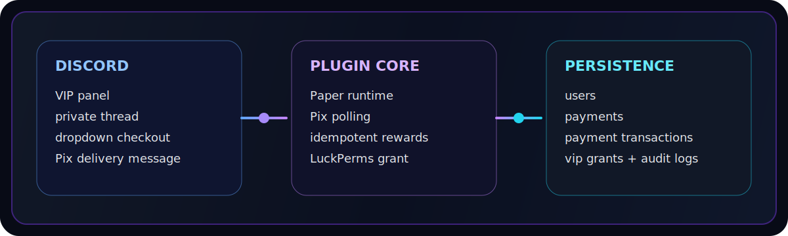
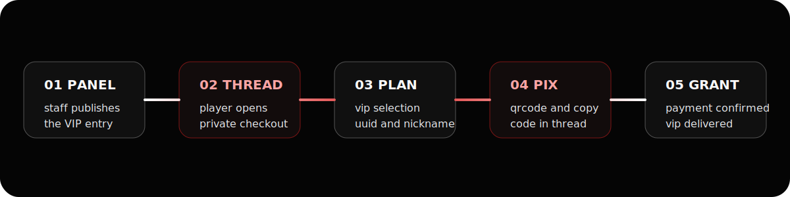

<div align="center">

# EletroFlow


### Discord VIP sales, Pix checkout, PostgreSQL persistence, and LuckPerms delivery inside a single Paper plugin


</div>


## Overview

EletroFlow is a plugin-first payment system for Minecraft servers. The Paper plugin itself connects to Discord, Efi Pix, PostgreSQL, and LuckPerms to run the full VIP purchase flow without a separate backend runtime.



### Core Features

- VIP panel publishing inside Discord
- private purchase threads
- Pix charge generation and reuse
- QR Code delivery inside Discord threads
- PDF receipt delivery after payment approval
- PostgreSQL persistence for users, payments, grants, and audit logs
- idempotent Pix confirmation handling
- LuckPerms VIP delivery


## Runtime

Only one artifact is deployed to the Minecraft server:

- [eletroflow-plugin-1.0.0-SNAPSHOT.jar](C:/Users/Admin/Desktop/pl/eletroflow-plugin/target/eletroflow-plugin-1.0.0-SNAPSHOT.jar)

Repository layout:

- [database](C:/Users/Admin/Desktop/pl/database) contains the PostgreSQL bootstrap script
- [eletroflow-plugin](C:/Users/Admin/Desktop/pl/eletroflow-plugin) contains the Paper plugin
- [eletroflow-shared](C:/Users/Admin/Desktop/pl/eletroflow-shared) contains shared DTOs and enums


## Purchase Flow



1. A staff member publishes the VIP panel with `/vip-panel`.
2. The player clicks the panel button and receives a private thread.
3. The player selects a VIP plan from the dropdown.
4. The player submits the Minecraft nickname and payer CPF.
5. The plugin creates or reuses a Pix charge through Efi.
6. The plugin stores the linked Discord identity, Minecraft identity, payer data, thread id, and selected plan.
7. The plugin polls Pix confirmation.
8. After confirmation, the plugin records the transaction, persists the VIP grant, applies the LuckPerms group, and sends a PDF receipt in the same thread.


## Discord Setup

Before using the purchase flow, configure the Discord section in [config.yml](C:/Users/Admin/Desktop/pl/eletroflow-plugin/src/main/resources/config.yml):

| Field | Purpose |
| --- | --- |
| `token` | Discord bot token |
| `guild-id` | Target server id |
| `panel-channel-id` | Channel where the VIP panel will be published |
| `support-role-id` | Role allowed to moderate purchase threads |
| `payment-poll-interval-seconds` | Interval used by the bot-side payment refresh flow |

Recommended server preparation:

- keep one channel dedicated to the VIP panel
- keep one staff role for purchase support
- use private threads to keep each purchase isolated

> Staff publishes the panel once, players open their own private thread, choose a VIP, submit Minecraft data, and receive the Pix charge in the same thread.

### Discord Usage

**Staff Flow**

1. Configure the bot token and ids in [config.yml](C:/Users/Admin/Desktop/pl/eletroflow-plugin/src/main/resources/config.yml).
2. Start the Paper server with the plugin enabled.
3. In Discord, run `/vip-panel` in the configured server.
4. The plugin publishes the purchase panel in the configured channel.

**Player Flow**

1. Click the purchase button on the panel.
2. Wait for the plugin to open a private purchase thread.
3. Choose the VIP plan from the dropdown.
4. Submit the Minecraft nickname and payer CPF.
5. Copy the Pix code or use the QR code attached by the bot.
6. Wait for confirmation in the same thread.
7. Receive the VIP group in Minecraft and the payment receipt PDF in Discord.

**Thread Rules**

- one player owns one purchase thread at a time
- only the ticket owner can continue the checkout steps
- support staff can follow the thread without taking ownership of the purchase
- the payment thread stores the selected plan and Pix context until confirmation


## Stack

- Java 21
- Paper 1.21.x
- PostgreSQL 14+
- JDA 5.x
- Efi Pix API
- LuckPerms
- Maven 3.9+


## Database Setup

Run the bootstrap script before starting the server:

- [init.sql](C:/Users/Admin/Desktop/pl/database/init.sql)

Or execute the commands manually in PostgreSQL:

```sql
CREATE USER eletroflow WITH PASSWORD 'troque_essa_senha';
CREATE DATABASE eletroflow OWNER eletroflow;
GRANT ALL PRIVILEGES ON DATABASE eletroflow TO eletroflow;
\connect eletroflow;
```

The script creates:

- PostgreSQL user
- database
- `users`
- `vip_plans`
- `payments`
- `payment_transactions`
- `vip_grants`
- `audit_logs`
- indexes


## Configuration

Main plugin configuration:

- [config.yml](C:/Users/Admin/Desktop/pl/eletroflow-plugin/src/main/resources/config.yml)

VIP catalog:

- [vip-plans.yml](C:/Users/Admin/Desktop/pl/eletroflow-plugin/src/main/resources/vip-plans.yml)

`config.yml` defines:

- server id
- Minecraft online-mode UUID resolution
- PostgreSQL connection
- Discord token and guild/channel ids
- Efi credentials
- certificate path
- receiver name and receiver document for receipt generation
- Pix expiration
- polling intervals

`vip-plans.yml` defines:

- VIP key
- display name
- amount
- currency
- LuckPerms group
- duration in days
- active flag
- sort order


## Installation

1. Execute [init.sql](C:/Users/Admin/Desktop/pl/database/init.sql) in PostgreSQL.
2. Adjust [config.yml](C:/Users/Admin/Desktop/pl/eletroflow-plugin/src/main/resources/config.yml) with PostgreSQL, Discord, and Efi credentials.
3. Adjust [vip-plans.yml](C:/Users/Admin/Desktop/pl/eletroflow-plugin/src/main/resources/vip-plans.yml) with the VIP catalog.
4. Build the project with Maven.
5. Place the generated jar inside the server `plugins` folder.
6. Start the Paper server with LuckPerms installed.


## Build

```bash
mvn clean package -DskipTests
```

Generated artifact:

- [eletroflow-plugin-1.0.0-SNAPSHOT.jar](C:/Users/Admin/Desktop/pl/eletroflow-plugin/target/eletroflow-plugin-1.0.0-SNAPSHOT.jar)


## Notes

- The plugin does not create the schema automatically.
- LuckPerms is required at startup.
- The PostgreSQL schema must exist before the plugin enables.
- `efi.receiver-name` and `efi.receiver-document` should be filled so the generated PDF receipt contains the receiver identity.
- The purchase modal asks for Minecraft nickname and payer CPF.


